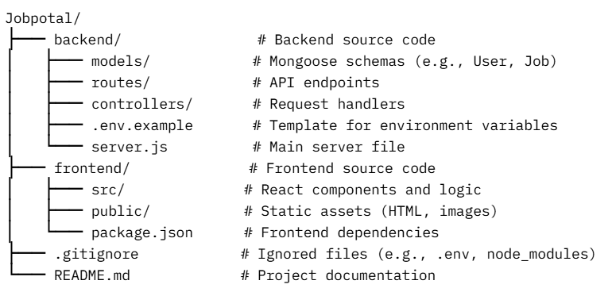

# Job Portal

A web application connecting job seekers and employers, allowing users to register, post jobs, and apply for opportunities.

## Features
- User registration and login with JWT authentication
- Create, view, and apply for job listings
- Search and filter jobs
- Profile management for users

## Technologies
- **Backend**: Node.js, Express.js, Mongoose
- **Database**: MongoDB
- **Authentication**: JSON Web Tokens (JWT)
- **Environment**: Managed with `.env` file

## Installation

### Prerequisites
- Node.js (v16 or higher)
- MongoDB (local or MongoDB Atlas)
- Git

### Steps
1. Clone the repository:
   ```bash
   git clone https://github.com/alexnguyenhao/Jobpotal.git
   cd Jobpotal
2. Install backend dependencies:
   - cd backend
   - npm install

3. Create a .env file in the backend folder using backend/.env.example as a template:
   - DB_URI=your_mongodb_connection_string
   - PORT=3000
   - JWT_SECRET=your_secret_key
4. Start the backend server
   - npm start
   - Usage
   - Open http://localhost:3000 in your browser (or the port specified in .env).
   Register a new account or log in to explore job listings.
   Post jobs or apply as a job seeker.


- Project Structure
   

Contributing
Fork the repository.
Create a feature branch: git checkout -b feature/your-feature.
Commit changes: git commit -m "Add your feature".
Push to the branch: git push origin feature/your-feature.
Submit a Pull Request.